# Work Item Triage Guide

This guide helps non-technical stakeholders categorise requests correctly when raising work items in Azure DevOps.

## Purpose

When you need to raise a work item, it's important to choose the correct category. This helps the development team prioritise and plan work effectively, ensuring your request gets the attention it deserves.

## Quick decision flowchart

Follow these steps to determine the correct work item category:

```mermaid
flowchart TD
    A[Start: What needs to happen?] --> B{Is something<br/>currently broken or<br/>not working as expected?}
    B -->|Yes| C{Was it working<br/>correctly before?}
    B -->|No| D{Does this add<br/>completely new<br/>functionality?}
    C -->|Yes| E[🐛 Defect Bug]
    C -->|No| F{Does the feature<br/>exist but needs<br/>improvement?}
    D -->|Yes| G[✨ New Feature]
    D -->|No| H{Is this blocking<br/>progress right now?}
    F -->|Yes| I[⬆️ Improvement Enhancement]
    F -->|No| D
    H -->|Yes| J{Is it a code issue?}
    H -->|No| K{Is this a potential<br/>future problem?}
    J -->|Yes| E
    J -->|No| L[🚧 Issue Impediment]
    K -->|Yes| M[⚠️ Risk]
    K -->|No| N{Do we need to<br/>investigate before<br/>deciding?}
    N -->|Yes| O[🔍 Spike]
    N -->|No| P[💼 Task Chore]
```

## Simple questions to ask yourself

Use these questions to help categorise your request:

### Is it broken right now?

**YES** → It's likely a **Defect (Bug)**

- Something that used to work no longer works
- The system is doing something it shouldn't do
- Users cannot complete a task they should be able to complete

**Examples:**

- "The login button doesn't respond when I click it"
- "The report shows the wrong totals"
- "I get an error message when trying to save"

### Does this add something brand new?

**YES** → It's likely a **New Feature**

- Introducing a capability that doesn't exist
- Solving a new user problem
- Adding new functionality to the system

**Examples:**

- "We need the ability to export data to Excel"
- "Add two-factor authentication to the login process"
- "Create a dashboard showing patient demographics"

### Is the feature working but could be better?

**YES** → It's likely an **Improvement (Enhancement)**

- The feature works but could be faster, clearer, or easier to use
- You want to refine existing functionality
- It's about making something good even better

**Examples:**

- "The search works but is too slow with large datasets"
- "Make the buttons larger so they're easier to click"
- "Add sorting to the existing table"

### Is something stopping you from making progress?

**YES** → It's likely an **Issue (Impediment)**

- You need approval, access, or information before you can proceed
- External dependencies are blocking work
- It's not a code problem but a process or organisational issue

**Examples:**

- "Waiting for legal approval to proceed with data processing"
- "Need access to the test environment"
- "Waiting for third-party API credentials"

### Could this cause problems in the future?

**YES** → It's likely a **Risk**

- You've identified a potential future problem
- Something might go wrong but hasn't happened yet
- You're concerned about capacity, security, or reliability

**Examples:**

- "The authentication service might not scale to handle peak load"
- "We might face compliance issues if we don't address data retention"
- "The server might run out of disk space in 3 months"

### Do you need to research before deciding?

**YES** → It's likely a **Spike**

- You need to investigate technical options
- You're not sure which approach to take
- You need to reduce uncertainty before estimating

**Examples:**

- "Investigate which authentication library best suits our needs"
- "Research database options for handling large volumes"
- "Evaluate whether we should build or buy a reporting solution"

### Is it maintenance work with no direct user benefit?

**YES** → It's likely a **Task (Chore / Tech Debt)**

- Technical work that needs doing to maintain system health
- Updates, upgrades, or refactoring
- Work that developers need to do to keep the system running smoothly

**Examples:**

- "Upgrade the authentication library to the latest version"
- "Refactor the database connection code"
- "Update server certificates before they expire"

## Common mistakes and how to avoid them

### Mistake 1: Logging preferences as bugs

!!! warning "Practices to avoid"
    **DON'T** log subjective improvements as bugs.

**Example:** "The login page background colour should be blue instead of green"

**Correct category:** Enhancement (unless the green background violates an agreed design specification)

### Mistake 2: Logging features as bugs

!!! warning "Practices to avoid"
    **DON'T** log missing functionality as a bug.

**Example:** "The system doesn't send email notifications" (when it never did)

**Correct category:** New Feature (unless email notifications were supposed to work but got broken)

### Mistake 3: Confusing risks with issues

!!! warning "Practices to avoid"
    **DON'T** log current problems as risks, or future concerns as bugs.

**Example:** "Risk: The login button is broken" → This is a **Bug**, not a Risk

**Example:** "Bug: The system might crash under high load" → This is a **Risk**, not a Bug

### Mistake 4: Mixing categories

!!! warning "Practices to avoid"
    **DON'T** combine multiple categories in one work item.

**Example:** "Fix the broken login button AND add two-factor authentication"

**Correct approach:** Create two separate work items - one Bug and one Feature

## Title and description best practices

Once you've identified the correct category, write a clear title and description:

### For Bugs (Defects)

**Title format:** Focus on user impact and expected behaviour

- ❌ Bad: "Login broken"
- ✅ Good: "Login button doesn't respond when clicked, preventing user access"

**Description should include:**

- What you expected to happen
- What actually happened
- Steps to reproduce the issue
- Any error messages you saw

### For Features and Enhancements

**Title format:** Use outcome-driven language

- ❌ Bad: "Add button"
- ✅ Good: "Add export to Excel button for patient records"

**Description should include:**

- Why this is needed (user benefit)
- What success looks like
- Any constraints or requirements

### For Issues (Impediments)

**Title format:** Clearly describe the blocker

- ❌ Bad: "Need stuff"
- ✅ Good: "Need test environment access for UAT testing"

**Description should include:**

- What is blocked
- What is needed to unblock
- Who can help resolve it

## Still not sure?

If you're uncertain which category to choose:

1. **Ask the question:** "Is this something broken right now, or something we want to add/improve?"
2. **Consult the team:** Discuss with the Scrum Master or Product Owner during refinement sessions.
3. **Start with your best guess:** The team can reclassify during triage if needed.

!!! tip "Practical tips"
    When in doubt, it's better to raise the item and let the team help categorise it correctly than to not raise it at all.

## Getting help

If you need assistance categorising work items:

- **Contact your Product Owner** - They can help you understand the correct category
- **Ask in Sprint Planning** - The team can discuss and classify items together
- **Use the taxonomy reference** - Review the [Work Item Taxonomy](work-item-taxonomy.md) for detailed definitions

!!! info "Further reading and information"
    [Work Item Taxonomy](work-item-taxonomy.md) - Detailed definitions and technical guidance

    [Planning and tracking work with Azure boards](planning-and-tracking-work-with-azure-boards.md)

    [Software development handbook](../software-development-handbook/introduction.md)

    [Agile delivery using Scrum](../software-development-handbook/agile-delivery-using-scrum.md)
